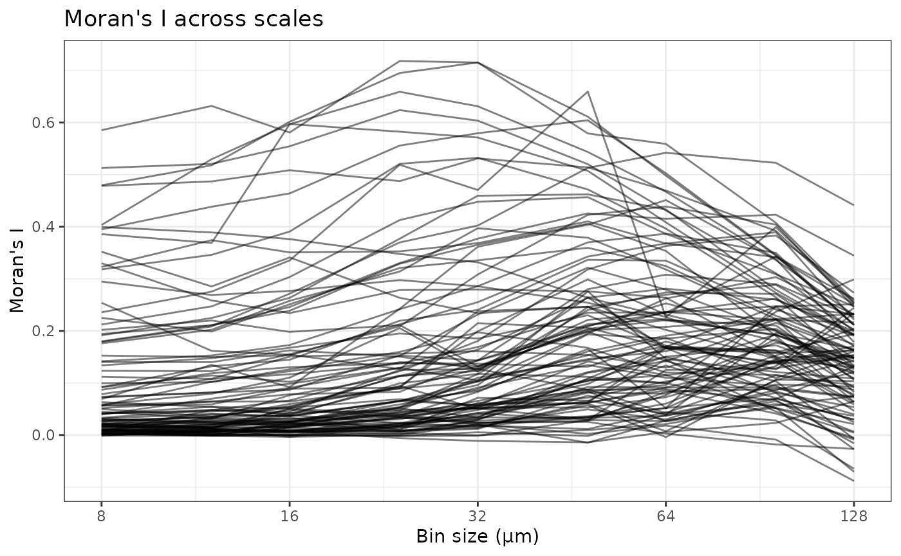
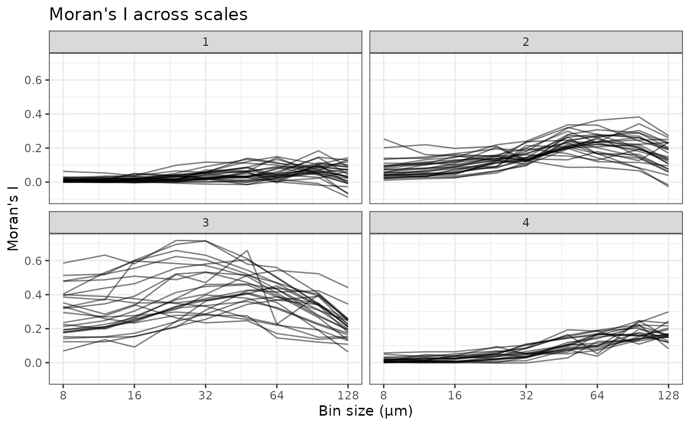
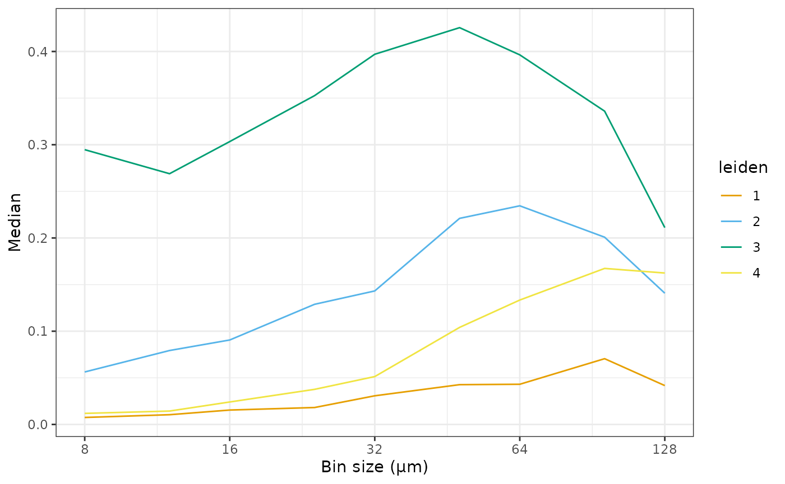
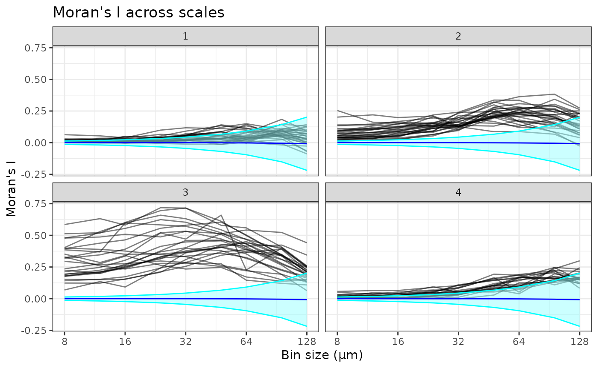
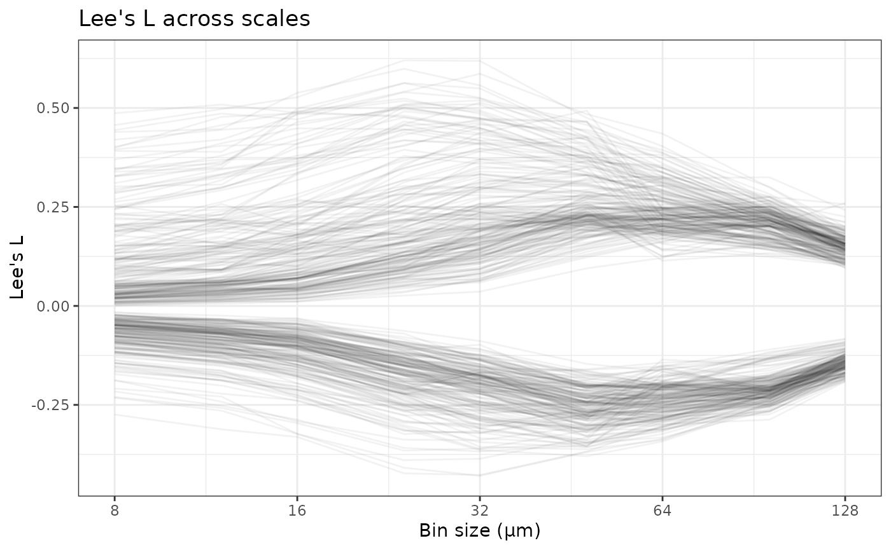
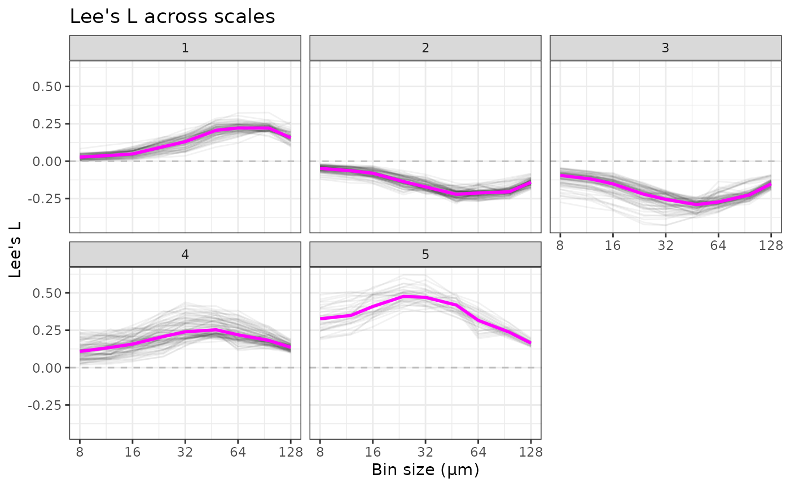
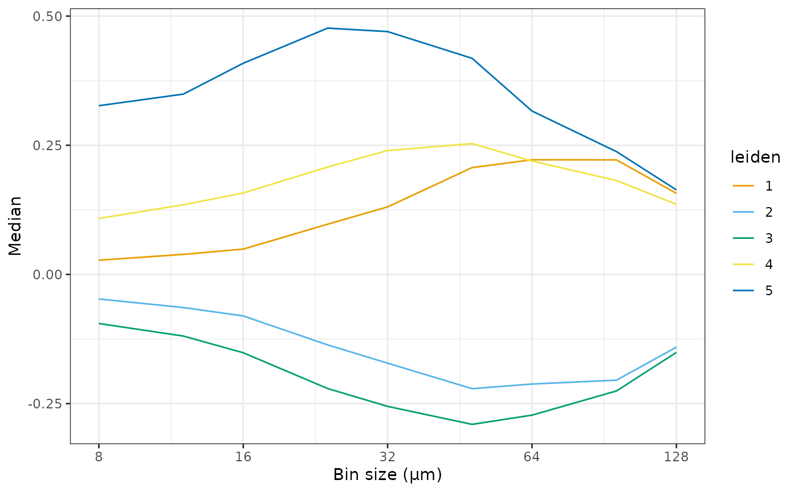
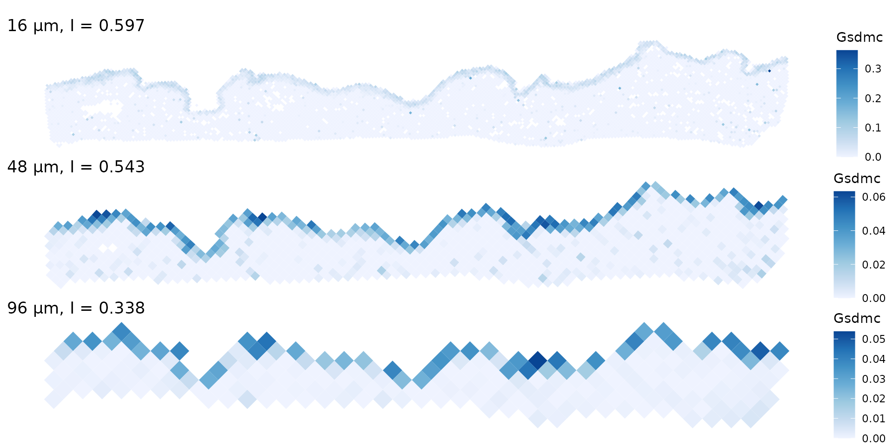
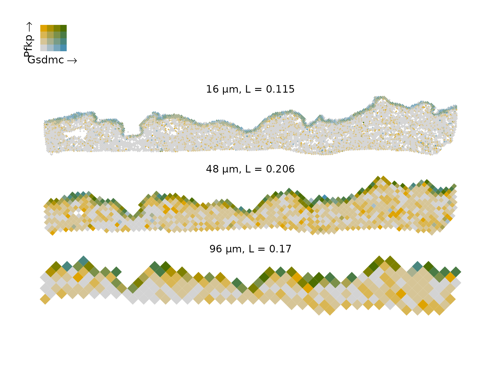

# workflow

## Introduction

In this vignette, we apply the multi-scale spatial analysis workflow as
shown in the [Wayfarer
paper](https://www.biorxiv.org/content/10.64898/2026.02.16.706245v1.abstract),
but on a different dataset. This Xenium dataset is from the paper [The
mechanotransducer Piezo1 coordinates metabolism and inflammation to
promote skin
growth](https://www.nature.com/articles/s41467-025-62270-3), which
investigates glycolysis and inflammation in mouse skin expansion,
mediated by Piezo1. Skin expansion was performed by injecting saline
into a subdermal implant. This is relevant because skin expansion occurs
in pregnancy and obesity, and is performed to create more skin for skin
grafting. This dataset has two samples (I believe biological replica)
per condition:

- Non-expanded – the implants were inserted but not expanded
- Expanded, 14 days post inflation (PI14)
- Expanded control (PI7)
- Expanded skin with topical Yoda1 treatment (PI7) which activates
  Piezo1

In this vignette, we perform a multi-scale spatial analysis with
Wayfarer to identify genes and gene co-expression whose multi-scale
spatial patterns differ across conditions.

``` r

library(Wayfarer)
library(Voyager)
library(SpatialFeatureExperiment)
library(sf)
library(BiocParallel)
library(alabaster.sfe)
library(dplyr)
library(readr)
library(ggplot2)
library(stringr)
library(purrr)
library(tidyr)
library(R.utils)
theme_set(theme_bw())
```

## Single sample

### Creating spatial bins

First, we apply spatial aggregation of various bin sizes to one sample
and perform some basic analyses. You can do the same analyses and
visualizations on all the other samples. The tissue boundary was
computed from a concave hull of cell centroids as the images were not
provided by the authors. See
[`SpatialFeatureExperiment::getTissueBoundaryConcave()`](https://pachterlab.github.io/SpatialFeatureExperiment/reference/getTissueBoundaryConcave.html).
For the purpose of demonstration, we can start with sample `expanded1`,
one of the expanded skin samples 14 days post injection.

The example dataset has been uploaded to OSF and can be downloaded with
functions in the Wayfarer package.

``` r

tb <- Piezo1TissueBoundary(sample = "expanded1")
plot(st_geometry(tb))
```


Also download the transcript spots

``` r

(tx_path <- Piezo1TxSpots("expanded1"))
#>                                                           expanded1 
#> "/home/runner/.cache/R/BiocFileCache/6e1616b1404b_expanded1.csv.gz"
```

With the transcript spots, we can create spatial aggregates with a range
of bin sizes (microns)

``` r

(sides <- sort(c(2^(3:7), 12 * 2^(0:3))))
#> [1]   8  12  16  24  32  48  64  96 128
```

The tissue boundary is used to remove bins that are entirely outside
tissue. Often there are transcript spots detected outside tissue. Also
unlike in the Wayfarer paper, hexagonal bins rather than square ones are
used here to show that hexagonal bins also work.

``` r

binned_path <- makeAggregates(tx_path,
                              out_path = "expanded1", sample_id = "expanded1",
                              tech = "Xenium", tissue_boundary = tb, sides = sides,
                              flip_geometry = FALSE,
                              square = TRUE, BPPARAM = MulticoreParam(4, progressbar = TRUE))
```

Since this takes a while to run, for the purpose of rendering this
vignette on GitHub Actions, the results have been uploaded to OSF and
can be downloaded

``` r

(binned_path <- Piezo1Binned("expanded1"))
#>                                                           expanded1 
#> "/home/runner/.cache/R/BiocFileCache/6e1673ff724f_expanded1.tar.gz"
```

Decompress it into the current directory

``` r

untar(binned_path)
```

Bins that overlap too little with tissue will be outliers in analyses
and cause artifacts, so here bins that overlap the tissue below a
proportion will be removed. These proportions were found by manual
tuning in the LUAD data used in the Wayfarer paper. Percentiles can also
be used with the `quantiles` argument. A value should be supplied to
each bin size.

The `runBinAnalyses` performs the basic analyses on each bin size after
removing bins that overlap too little with the tissue:

1.  Log normalize the data, using proportion of each bin overlapping
    tissue as size factor instead of total counts. Using the proportion
    vs. total counts makes a big difference in downstream analyses.
2.  Non-spatial PCA on log normalized data
3.  Moran’s I on each gene, with log normalized data
4.  Lee’s L on all gene pairs, with log normalized data

``` r

runBinAnalyses("expanded1", "expanded1/bin_analyses", tissue_geometry = tb,
               min_props = 0.8, queen = TRUE,
               BPPARAM = MulticoreParam(2, progressbar = TRUE))
```

Since the analyses can take a while to run, the results can also be
downloaded from OSF

``` r

(bin_analyses_path <- Piezo1BinAnalyses("expanded1"))
#>                                                                expanded1 
#> "/home/runner/.cache/R/BiocFileCache/6e162ba40ab9_expanded1_esda.tar.gz"
untar(bin_analyses_path)
```

### Moran’s I curves

Next see how Moran’s I changes with bin sizes in this sample

``` r

df_moran <- read_csv("expanded1/bin_analyses/df_moran.csv")
#> Rows: 900 Columns: 4
#> ── Column specification ────────────────────────────────────────────────────────
#> Delimiter: ","
#> chr (2): gene, sample
#> dbl (2): moran, side
#> 
#> ℹ Use `spec()` to retrieve the full column specification for this data.
#> ℹ Specify the column types or set `show_col_types = FALSE` to quiet this message.
```

``` r

plotMoranCurves(df_moran)
```



Here each gene has a curve. We see different kinds of curves: some genes
have higher Moran’s I at small scales that decrease at larger scales.
Some form a peak between 16 and 32 microns in bin diameter. Some form a
peak between 64 and 128 microns. We can cluster the curves to better
visualize these different patterns:

``` r

df_moran2 <- clusterMoranCurves(df_moran)
names(df_moran2)
#> [1] "moran"        "gene"         "side"         "sample"       "hclust"      
#> [6] "leiden"       "hclust_diffs" "leiden_diffs"
```

Hierarchical clustering and Leiden are used to cluster the curves, both
the original values and differences between adjacent bin sizes
(hclust_diffs and leiden_diffs).

Plot the clusters

``` r

plotMoranCurves(df_moran2, facet_by = "leiden")
```



Clusters 1 and 4 likely have no actual spatial structure.

Plot the cluster medians

``` r

plotClusterMedians(df_moran2, "leiden")
```



Plot the Moran’s I curves with the mean and variance of Moran’s I under
the null hypothesis of no spatial autocorrelation, and the 2.5% and
97.5% quantiles after Bonferroni correction for the number of genes and
bin sizes

``` r

# Need to read all bin sizes for the spatial neighborhood graphs
sfes <- readBins("expanded1/bin_analyses", sides = sides)
#> >>> Reading SpatialExperiment
#> >>> Reading colgeometries
#> >>> Reading spatial graphs
#> >>> Reading SpatialExperiment
#> >>> Reading colgeometries
#> >>> Reading spatial graphs
#> >>> Reading SpatialExperiment
#> >>> Reading colgeometries
#> >>> Reading spatial graphs
#> Warning in sn2listw(df, style = style, zero.policy = zero.policy,
#> from_mat2listw = TRUE): neighbour object has 3 sub-graphs
#> Warning in mat2listw(as(altReadObject(dddd), "CsparseMatrix"), style =
#> method$args$style, : neighbour object has 3 sub-graphs
#> >>> Reading SpatialExperiment
#> >>> Reading colgeometries
#> >>> Reading spatial graphs
#> >>> Reading SpatialExperiment
#> >>> Reading colgeometries
#> >>> Reading spatial graphs
#> >>> Reading SpatialExperiment
#> >>> Reading colgeometries
#> >>> Reading spatial graphs
#> >>> Reading SpatialExperiment
#> >>> Reading colgeometries
#> >>> Reading spatial graphs
#> >>> Reading SpatialExperiment
#> >>> Reading colgeometries
#> >>> Reading spatial graphs
#> >>> Reading SpatialExperiment
#> >>> Reading colgeometries
#> >>> Reading spatial graphs
mean_vars <- getMoranMeanVar(sfes, "moran")
```

``` r

plotMoranCurves(df_moran2, facet_by = "leiden", mean_vars = mean_vars,
                show_null = TRUE)
```



### Lee’s L curves

Also read Lee’s L; to make clustering easier, a cutoff of 0.2 is set so
that gene pairs with Lee’s L lower than 0.2 in all bin sizes will be
removed.

``` r

df_lee <-readLeeSamples("expanded1/bin_analyses", cutoff = 0.2)
```

Due to the large number of gene pairs, a smaller subset can be plotted
to prevent the plot from becoming a solid block

``` r

plotLeeCurves(df_lee)
```



Here each gene pair has a curve. Some gene pairs have higher Lee’s L at
smaller scales which decrease at larger scales. Some peak between 16 and
32 microns. Some peak between 64 and 128 microns. Some have low Lee’s L
at small scales which increase at larger scales. Some have negative
Lee’s L at small scales which become positive at larger scales. Some
have weakly negative Lee’s L at smaller scales which becomes lower at
intermediate scales.

Cluster Lee’s L curves to better visualize these patterns

``` r

df_lee2 <- clusterLeeCurves(df_lee)
```

``` r

plotLeeCurves(df_lee2, facet_by = "leiden", show_median = TRUE) +
    geom_hline(yintercept = 0, linetype = 2, color = "gray")
```



``` r

plotClusterMedians(df_lee2, "leiden")
```



Unfotunately we can’t plot that interval under null hypothesis like in
Moran’s I because the mean and variance of Lee’s L under the null
hypothesis of no spatial autocorrelation differ for each gene pair,
depending on their Pearson correlation. When there’s no spatial pattern,
gene pairs with high Pearson correlation can still get a moderate value
away from 0. In addition, computing such mean and variance requires a
dense square matrix, so they can only be computed for larger bin sizes
where the number of bins is smaller.

### Plotting multiple bin sizes

Here we plot gene expression in space in different bin sizes

``` r

# Reduce empty space
for (i in seq_along(sfes)) {
    sfes[[i]] <- rotateMinRect(sfes[[i]])
}
```

Randomly select a gene from Leiden cluster 4

``` r

set.seed(29)
gene_use <- df_moran2 |> 
    filter(leiden == 3) |> 
    pull(gene) |> 
    sample(1)
```

``` r

plotSFEs(sfes[c("16", "48", "96")], gene_use, show_sizes = TRUE, ncol = 1)
```



We can also make this kind of plot for Lee’s L, with a bivariate
palette. Randomly select a gene pair

``` r

set.seed(29)
pair_use <- df_lee2 |> 
    filter(leiden == 4) |> 
    pull(pair) |> 
    sample(1) |> 
    str_split(pattern = "_", simplify = TRUE) |> 
    as.vector()
```

``` r

plotSFEsBiscale(sfes[c("16", "48", "96")], pair_use[1], pair_use[2], 
                df_lee = df_lee, ncol = 1, legend_index = 1,
                heights = rep(1, 5))
```



## Multiple samples

After seeing the Moran’s I and Lee’s L curves for one sample, one may
say, “Interesting, so what?” So we’ll compare these curves across
multiple biological conditions and see what genes and gene pairs differ
in this multi-scale manner that may not be apparent when only one
spatial scale is analyzed. Here we get which sample is from which
biological condition

``` r

data("sample_info")
sample_info
#> # A tibble: 8 × 2
#>   sample        condition   
#>   <chr>         <chr>       
#> 1 expanded1     PI14        
#> 2 expanded2     PI14        
#> 3 expanded1_pi7 PI7         
#> 4 expanded2_pi7 PI7         
#> 5 nonexpanded1  non-expanded
#> 6 nonexpanded2  non-expanded
#> 7 yoda1         Yoda1       
#> 8 yoda2         Yoda1
```

The method to find what’s different across stages is currently subject
to change.

``` r

unlink(sample_info$sample, recursive = TRUE)
```

## Session info

``` r

sessionInfo()
#> R version 4.6.1 (2026-06-24)
#> Platform: x86_64-pc-linux-gnu
#> Running under: Ubuntu 24.04.4 LTS
#> 
#> Matrix products: default
#> BLAS:   /usr/lib/x86_64-linux-gnu/openblas-pthread/libblas.so.3 
#> LAPACK: /usr/lib/x86_64-linux-gnu/openblas-pthread/libopenblasp-r0.3.26.so;  LAPACK version 3.12.0
#> 
#> locale:
#>  [1] LC_CTYPE=C.UTF-8          LC_NUMERIC=C             
#>  [3] LC_TIME=C.UTF-8           LC_COLLATE=C.UTF-8       
#>  [5] LC_MONETARY=C.UTF-8       LC_MESSAGES=C.UTF-8      
#>  [7] LC_PAPER=C.UTF-8          LC_NAME=C.UTF-8          
#>  [9] LC_ADDRESS=C.UTF-8        LC_TELEPHONE=C.UTF-8     
#> [11] LC_MEASUREMENT=C.UTF-8    LC_IDENTIFICATION=C.UTF-8
#> 
#> time zone: UTC
#> tzcode source: system (glibc)
#> 
#> attached base packages:
#> [1] stats     graphics  grDevices utils     datasets  methods   base     
#> 
#> other attached packages:
#>  [1] R.utils_2.13.0                  R.oo_1.27.1                    
#>  [3] R.methodsS3_1.8.2               tidyr_1.3.2                    
#>  [5] purrr_1.2.2                     stringr_1.6.0                  
#>  [7] ggplot2_4.0.3                   readr_2.2.0                    
#>  [9] dplyr_1.2.1                     alabaster.sfe_1.5.0            
#> [11] alabaster.base_1.13.2           BiocParallel_1.47.0            
#> [13] sf_1.1-2                        Voyager_1.15.2                 
#> [15] SpatialFeatureExperiment_1.13.2 Wayfarer_0.99.0                
#> [17] BiocStyle_2.41.0               
#> 
#> loaded via a namespace (and not attached):
#>   [1] fs_2.1.0                    matrixStats_1.5.0          
#>   [3] spatialreg_1.4-3            bitops_1.1-0               
#>   [5] EBImage_4.55.2              httr_1.4.8                 
#>   [7] RColorBrewer_1.1-3          insight_1.5.2              
#>   [9] numDeriv_2016.8-1.1         tools_4.6.1                
#>  [11] backports_1.5.1             utf8_1.2.6                 
#>  [13] R6_2.6.1                    HDF5Array_1.41.1           
#>  [15] rhdf5filters_1.25.4         withr_3.0.3                
#>  [17] sp_2.2-3                    cli_3.6.6                  
#>  [19] Biobase_2.73.2              textshaping_1.0.5          
#>  [21] performance_0.17.1          RBioFormats_1.13.0         
#>  [23] sandwich_3.1-3              labeling_0.4.3             
#>  [25] marginaleffects_0.32.0      alabaster.se_1.13.0        
#>  [27] sass_0.4.10                 mvtnorm_1.4-2              
#>  [29] arrow_25.0.0                S7_0.2.2                   
#>  [31] proxy_0.4-29                pkgdown_2.2.1              
#>  [33] systemfonts_1.3.2           scico_1.5.0                
#>  [35] limma_3.69.4                RSQLite_3.53.3             
#>  [37] httpcode_0.3.0              generics_0.1.4             
#>  [39] vroom_1.7.1                 car_3.1-5                  
#>  [41] spdep_1.4-2                 scrapper_1.7.4             
#>  [43] Matrix_1.7-5                S4Vectors_0.51.6           
#>  [45] abind_1.4-8                 terra_1.9-34               
#>  [47] lifecycle_1.0.5             multcomp_1.4-31            
#>  [49] yaml_2.3.12                 edgeR_4.11.6               
#>  [51] carData_3.0-6               SummarizedExperiment_1.43.0
#>  [53] rhdf5_2.57.9                SparseArray_1.13.2         
#>  [55] BiocFileCache_3.3.0         grid_4.6.1                 
#>  [57] blob_1.3.0                  dqrng_0.4.1                
#>  [59] crayon_1.5.3                alabaster.spatial_1.13.0   
#>  [61] lattice_0.22-9              beachmat_2.29.0            
#>  [63] magick_2.9.1                zeallot_0.2.0              
#>  [65] pillar_1.11.1               knitr_1.51                 
#>  [67] GenomicRanges_1.65.1        rjson_0.2.23               
#>  [69] osfr_0.2.9                  boot_1.3-32                
#>  [71] estimability_2.0.0          sfarrow_0.4.1              
#>  [73] codetools_0.2-20            wk_0.9.5                   
#>  [75] glue_1.8.1                  data.table_1.18.4          
#>  [77] memuse_4.2-3                urltools_1.7.3.1           
#>  [79] vctrs_0.7.3                 png_0.1-9                  
#>  [81] Rdpack_2.6.6                gtable_0.3.6               
#>  [83] assertthat_0.2.1            cachem_1.1.0               
#>  [85] xfun_0.60                   rbibutils_2.4.1            
#>  [87] S4Arrays_1.13.0             DropletUtils_1.33.0        
#>  [89] Seqinfo_1.3.0               coda_0.19-4.1              
#>  [91] reformulas_0.4.4            survival_3.8-6             
#>  [93] SingleCellExperiment_1.35.2 sfheaders_0.4.5            
#>  [95] rJava_1.0-18                units_1.0-1                
#>  [97] statmod_1.5.2               bluster_1.23.0             
#>  [99] TH.data_1.1-5               nlme_3.1-169               
#> [101] bit64_4.8.2                 alabaster.ranges_1.13.0    
#> [103] filelock_1.0.3              bslib_0.12.0               
#> [105] afex_1.5-1                  KernSmooth_2.23-26         
#> [107] otel_0.2.0                  spData_2.3.5               
#> [109] BiocGenerics_0.59.11        DBI_1.3.0                  
#> [111] tidyselect_1.2.1            emmeans_2.0.4              
#> [113] bit_4.6.0                   compiler_4.6.1             
#> [115] curl_7.1.0                  httr2_1.3.0                
#> [117] BiocNeighbors_2.7.2         h5mread_1.5.0              
#> [119] xml2_1.6.0                  desc_1.4.3                 
#> [121] DelayedArray_0.39.4         triebeard_0.4.1            
#> [123] bookdown_0.47               scales_1.4.0               
#> [125] classInt_0.4-11             tiff_0.1-12                
#> [127] SpatialExperiment_1.23.0    digest_0.6.39              
#> [129] fftwtools_0.9-11            minqa_1.2.8                
#> [131] alabaster.matrix_1.13.1     rmarkdown_2.31             
#> [133] XVector_0.53.0              htmltools_0.5.9            
#> [135] pkgconfig_2.0.3             jpeg_0.1-11                
#> [137] lme4_2.0-6                  sparseMatrixStats_1.25.0   
#> [139] MatrixGenerics_1.25.0       dbplyr_2.6.0               
#> [141] fastmap_1.2.0               rlang_1.3.0                
#> [143] htmlwidgets_1.6.4           DelayedMatrixStats_1.35.0  
#> [145] farver_2.1.2                jquerylib_0.1.4            
#> [147] zoo_1.9-0                   biscale_1.1.0              
#> [149] jsonlite_2.0.0              RCurl_1.98-1.19            
#> [151] magrittr_2.0.5              Formula_1.2-6              
#> [153] scuttle_1.23.1              s2_1.1.11                  
#> [155] patchwork_1.3.2             Rhdf5lib_2.1.0             
#> [157] Rcpp_1.1.2                  ggnewscale_0.5.2           
#> [159] stringi_1.8.9               alabaster.schemas_1.13.0   
#> [161] MASS_7.3-65                 plyr_1.8.9                 
#> [163] parallel_4.6.1              deldir_2.0-4               
#> [165] splines_4.6.1               hms_1.1.4                  
#> [167] locfit_1.5-9.12             igraph_2.3.3               
#> [169] reshape2_1.4.5              stats4_4.6.1               
#> [171] LearnBayes_2.15.2           crul_1.6.0                 
#> [173] evaluate_1.0.5              BiocManager_1.30.27        
#> [175] tzdb_0.5.0                  nloptr_2.2.1               
#> [177] alabaster.sce_1.13.0        e1071_1.7-17               
#> [179] RSpectra_0.16-2             class_7.3-23               
#> [181] ragg_1.5.2                  tibble_3.3.1               
#> [183] lmerTest_3.2-1              memoise_2.0.1              
#> [185] IRanges_2.47.2              cluster_2.1.8.2
```
